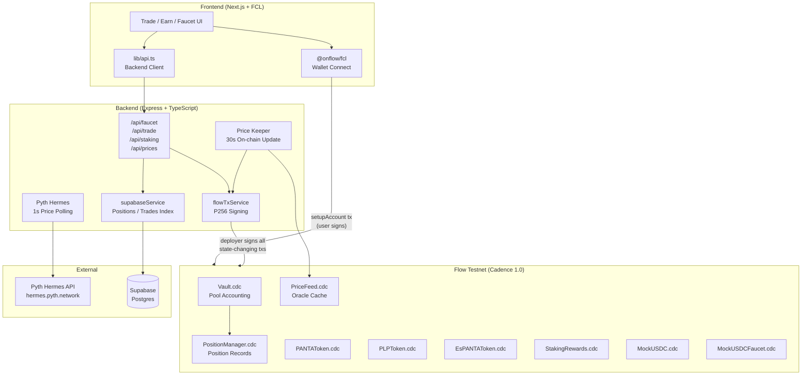
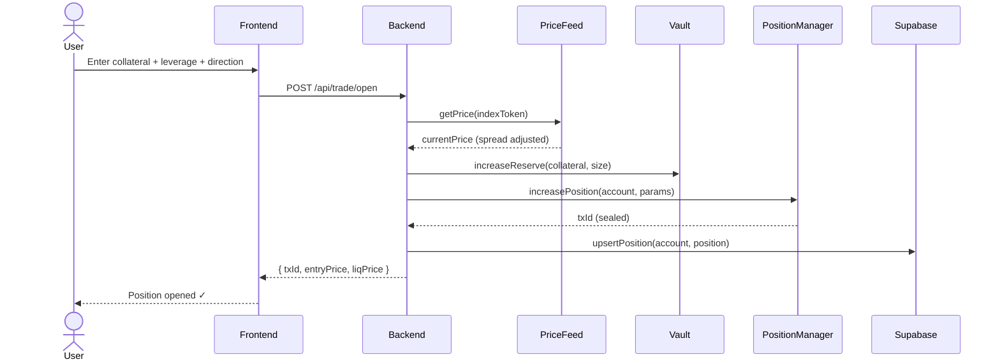
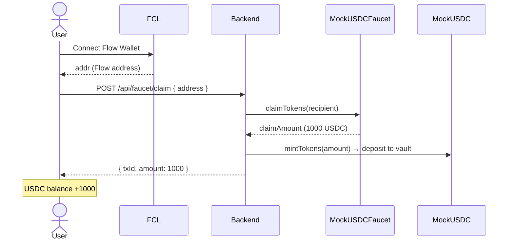
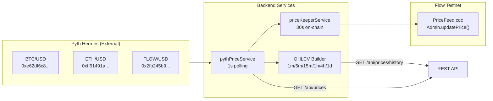
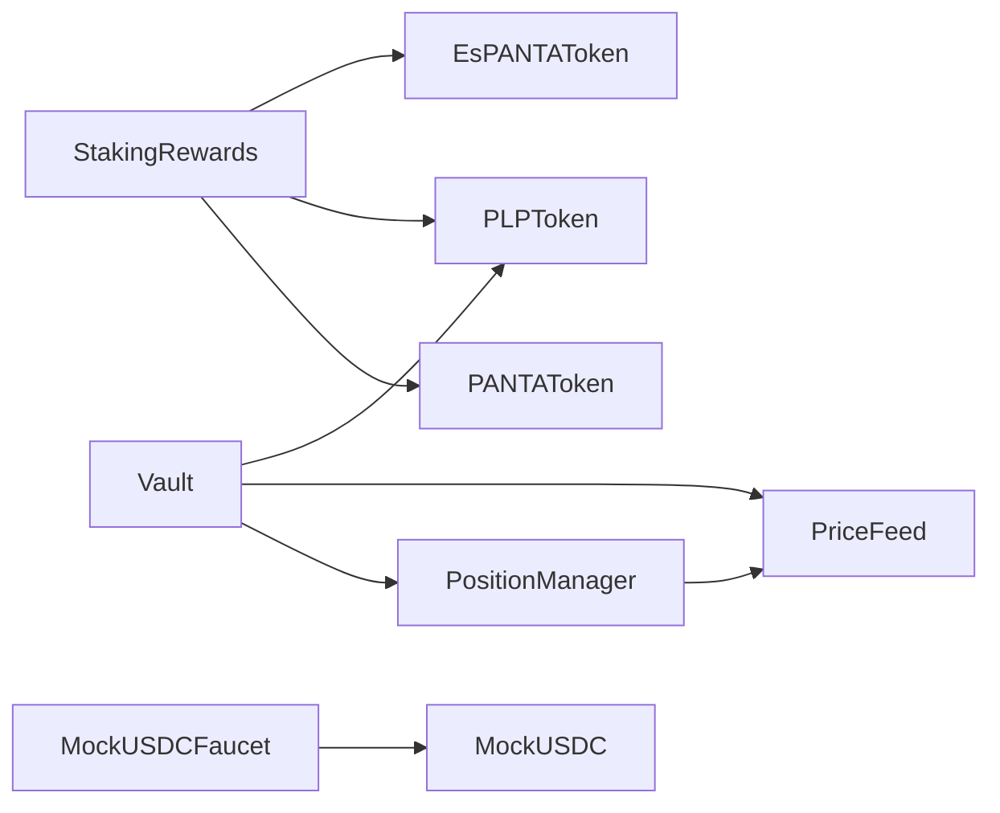
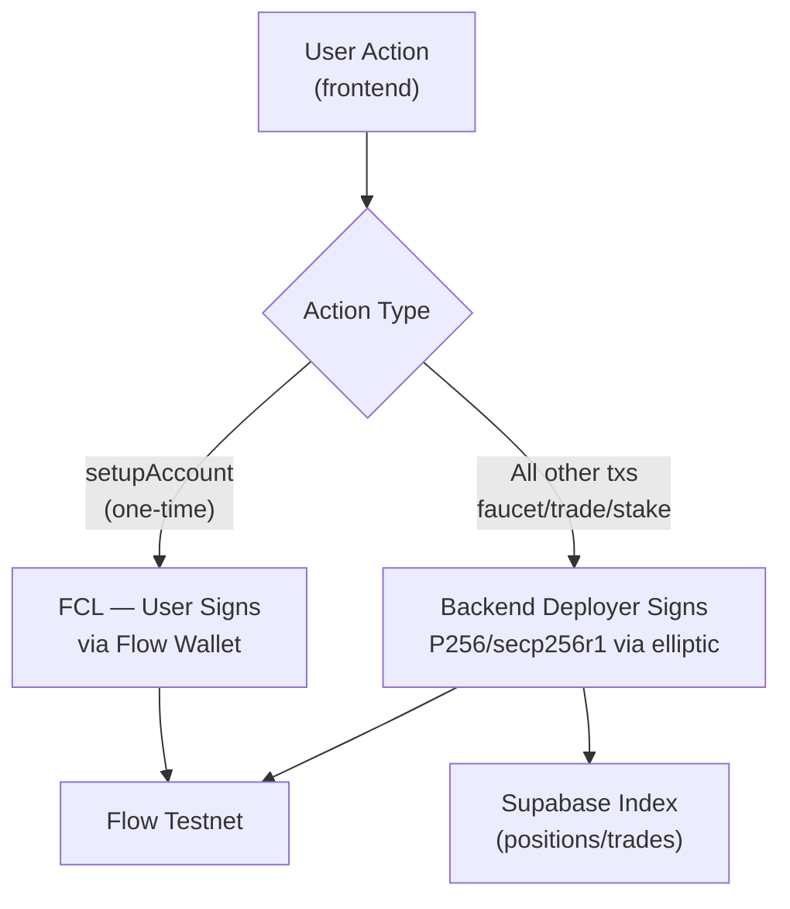

# PantaDEX — Perpetual DEX on Flow Blockchain

A fully on-chain perpetual futures DEX built with native Cadence contracts on Flow Testnet. Inspired by GMX v1 architecture, rebuilt from scratch for Flow's resource-oriented programming model.

**Testnet Deployment:** [`0xa6d1a763be01f1fa`](https://testnet.flowscan.io/account/0xa6d1a763be01f1fa)

---

## Architecture Overview



---

## System Flow Diagrams

### Trading Flow (Open Position)



### Faucet Flow



### Price Feed Architecture



---

## Smart Contracts

All 9 contracts deployed at [`0xa6d1a763be01f1fa`](https://testnet.flowscan.io/account/0xa6d1a763be01f1fa)

| Contract | Description |
|---|---|
| `Vault.cdc` | Core pool: AUM tracking, reserve management, fee collection |
| `PositionManager.cdc` | Position lifecycle: open, increase, decrease, close, liquidate, **addCollateral** |
| `PriceFeed.cdc` | On-chain oracle cache, updated every 30s by backend keeper |
| `PANTAToken.cdc` | Governance & staking token (FungibleToken v2) |
| `PLPToken.cdc` | Liquidity provider token, whitelist-controlled transfers |
| `EsPANTAToken.cdc` | Escrowed PANTA — staking rewards, non-transferable |
| `StakingRewards.cdc` | Block-based reward accrual for PANTA and PLP stakers |
| `MockUSDC.cdc` | Test USDC token (6 decimals, FungibleToken v2) |
| `MockUSDCFaucet.cdc` | 1000 USDC / 8h cooldown per address |

### PositionManager — addCollateral

```cadence
// Increases position collateral without changing size.
// Constraint: size >= newCollateral (leverage must stay ≥ 1×)
access(all) fun addCollateral(
    account: Address,
    collateralToken: String,
    indexToken: String,
    collateralDelta: UFix64,
    isLong: Bool
)
```

Emits `PositionIncreased` with `sizeDelta: 0.0` to distinguish a collateral-top-up from a full size increase.

### TradingRouter — addCollateral

The `TradingRouter` contract wraps `PositionManager.addCollateral` with vault accounting:

1. Accepts a `@MockUSDC.Vault` resource from the caller
2. Deposits it into the protocol's USDC vault (`increaseReserve`)
3. Calls `PositionManager.addCollateral` to update the position record

```cadence
access(all) fun addCollateral(
    account: Address,
    collateral: @MockUSDC.Vault,  // resource — moved, not copied
    indexToken: String,
    isLong: Bool
)
```

The FCL transaction (`ADD_COLLATERAL_TX`) withdraws from the user's USDC vault, wraps it in the resource, and passes it to `TradingRouter.addCollateral`. The deployer account is **not** involved — this is one of the few user-signed transactions.

### Contract Interaction Map



---

## Backend API

Base URL: `http://localhost:3001/api`

| Method | Endpoint | Description |
|---|---|---|
| GET | `/prices` | Live BTC/ETH/FLOW/USDC prices |
| GET | `/prices/history` | OHLCV candles `?token=BTC&interval=1m&limit=500` |
| POST | `/faucet/claim` | Claim 1000 test USDC `{ address }` |
| GET | `/faucet/status` | Cooldown check `?address=` |
| POST | `/trade/open` | Open perpetual position |
| POST | `/trade/close` | Close/decrease position |
| POST | `/trade/add-collateral` | Add collateral to existing position (reduces leverage) |
| GET | `/trade/positions` | Active positions `?account=` |
| GET | `/trades` | Trade history `?account=` |
| POST | `/sltp` | Set Stop Loss / Take Profit for a position |
| POST | `/panta/buy` | Buy PANTA with USDC (100 USDC = 1 PANTA) |
| POST | `/staking/stake` | Stake PANTA or PLP |
| POST | `/staking/unstake` | Unstake tokens |
| POST | `/staking/claim` | Claim staking rewards |
| GET | `/staking/info` | Staking balances & pending rewards `?account=` |
| GET | `/stats` | Protocol TVL, volume, OI, PLP price/APR |

### SL/TP Endpoint

`POST /api/sltp` — stores stop-loss and take-profit price levels in Supabase. These are **off-chain triggers**: the backend's liquidation keeper (`priceKeeperService`) polls open positions with active SL/TP and auto-closes them when the live price crosses the target.

```json
// Request body
{
  "account": "0xabc123",
  "indexToken": "BTC",
  "isLong": true,
  "stopLoss": 58000.00,
  "takeProfit": 72000.00
}
```

### Add Collateral Endpoint

`POST /api/trade/add-collateral` — calls `PositionManager.addCollateral()` on-chain. Increases position collateral without changing size, effectively reducing leverage and raising the liquidation price. The constraint `size >= collateral` is enforced at the contract level.

### Transaction Signing Model



> **Why deployer-signs?** Flow requires a funded account for all transactions. Users only need a Flow wallet for `setupAccount` (creates USDC + PANTA vaults). The deployer holds all Admin resources and signs everything else, enabling a gasless UX.

> **Exception — addCollateral:** This transaction is signed by the user via FCL because it moves a `@MockUSDC.Vault` resource directly from the user's account storage. The deployer cannot access user-owned resources.

---

## Frontend

Built with Next.js 15 (App Router) + Tailwind CSS + `@tanstack/react-query`

| Page | Description |
|---|---|
| `/` | Landing page with live market stats |
| `/trade` | Perp trading — BTC/USD & ETH/USD, up to 10x leverage |
| `/earn` | Stake PANTA/PLP, claim rewards, buy PLP |
| `/leaderboard` | Top traders by PnL |

**Key hooks:**

| Hook | Description |
|---|---|
| `useFlowNetwork` | FCL wallet state (connect/disconnect) |
| `useTradeForm` | Form state + `submit()` → POST /api/trade/open |
| `usePositions` | Active positions from backend, `useClosePosition` mutation |
| `usePrices` | Live prices, 3s refetch |
| `usePriceHistory` | OHLCV for TradingView chart |
| `useFaucetStatus` | Cooldown state, `useClaimFaucet` mutation |
| `useStakingInfo` | Staked amounts + pending rewards |
| `useAddCollateral` | FCL mutation — calls `addCollateral` tx, invalidates positions query |
| `useSetSLTP` | Sets stop-loss / take-profit via POST /api/sltp, invalidates positions query |

---

## Repository Structure

```
panta-flow/
├── flow-perpdex/
│   ├── cadence/
│   │   ├── contracts/          # 9 Cadence contracts
│   │   ├── transactions/
│   │   │   ├── admin/          # setupMinters, refillFaucet, updatePriceFeed
│   │   │   ├── user/           # setupAccount (FCL wallet)
│   │   │   ├── faucet/         # claimUSDCForRecipient
│   │   │   ├── positions/      # increasePositionForUser, decreasePositionForUser
│   │   │   ├── staking/        # stakeForUser, unstakeForUser, claimRewardsForUser
│   │   │   └── panta/          # mintPANTAForUser
│   │   └── scripts/            # Read-only Cadence scripts
│   └── flow.json               # Testnet deployment config
├── backend/
│   ├── src/
│   │   ├── services/           # pythPriceService, flowTxService, priceKeeperService, supabaseService
│   │   ├── routes/             # faucet, trading, staking, prices, stats, trades
│   │   ├── config/             # flow.ts (contract addresses, executeScript)
│   │   └── scripts/            # adminInit.ts (run once after deploy)
│   ├── Dockerfile
│   └── .env.example
├── frontend/
│   ├── src/
│   │   ├── app/                # Next.js App Router pages
│   │   ├── components/         # trade/, earn/, faucet/, layout/, shared/
│   │   ├── hooks/              # All React Query hooks
│   │   └── lib/                # fcl.ts, api.ts, config/
│   └── .env.local              # NEXT_PUBLIC_API_URL
└── supabase/
    └── schema.sql              # positions, trades, price_history, leaderboard view
```

---

## Setup & Running

### Prerequisites

- [Flow CLI](https://docs.onflow.org/flow-cli/install/) v2+
- Node.js 20+
- A funded Flow testnet account ([faucet](https://faucet.flow.com/fund-account))

### Environment Variables

```bash
# backend/.env
FLOW_DEPLOYER_ADDRESS=0xa6d1a763be01f1fa
FLOW_DEPLOYER_PRIVATE_KEY=<p256_private_key>
FLOW_MOCKUSDC_ADDRESS=0xa6d1a763be01f1fa
FLOW_PANTA_ADDRESS=0xa6d1a763be01f1fa
FLOW_PLP_ADDRESS=0xa6d1a763be01f1fa
FLOW_ESPANTA_ADDRESS=0xa6d1a763be01f1fa
FLOW_PRICEFEED_ADDRESS=0xa6d1a763be01f1fa
FLOW_VAULT_ADDRESS=0xa6d1a763be01f1fa
FLOW_POSITIONMANAGER_ADDRESS=0xa6d1a763be01f1fa
FLOW_FAUCET_ADDRESS=0xa6d1a763be01f1fa
FLOW_STAKING_ADDRESS=0xa6d1a763be01f1fa

# Optional — positions/trades indexing
SUPABASE_URL=https://xxx.supabase.co
SUPABASE_SERVICE_KEY=...
```

```bash
# frontend/.env.local
NEXT_PUBLIC_API_URL=http://localhost:3001/api
```

### Running Locally

```bash
# 1. Backend
cd backend
npm install
npm run dev          # starts on :3001

# 2. Admin init (run once after deploy)
npm run init         # setupMinters + refill 10M USDC to faucet

# 3. Frontend
cd ../frontend
npm install
npm run dev          # starts on :3000
```

### Deploy Contracts

```bash
cd flow-perpdex
flow project deploy --network testnet
```

---

## Technical Stack

| Layer | Technology |
|---|---|
| Blockchain | Flow Testnet (Cadence 1.0) |
| Smart Contracts | Cadence — FungibleToken v2 resource model |
| Price Oracle | Pyth Hermes REST API (1s) |
| Transaction Signing | P256/secp256r1 via `elliptic` + `sha3` |
| Backend | Node.js + Express + TypeScript |
| Database | Supabase (PostgreSQL) |
| Frontend | Next.js 15 + Tailwind CSS + Framer Motion |
| State Management | TanStack React Query v5 |
| Wallet | Flow Client Library (FCL) — testnet |
| Deployment | Railway (backend) + Vercel (frontend) |

---

## Links

- **Explorer:** https://testnet.flowscan.io/account/0xa6d1a763be01f1fa
- **Flow Docs:** https://developers.flow.com
- **Pyth Hermes:** https://hermes.pyth.network
- **Testnet Faucet:** https://faucet.flow.com/fund-account
